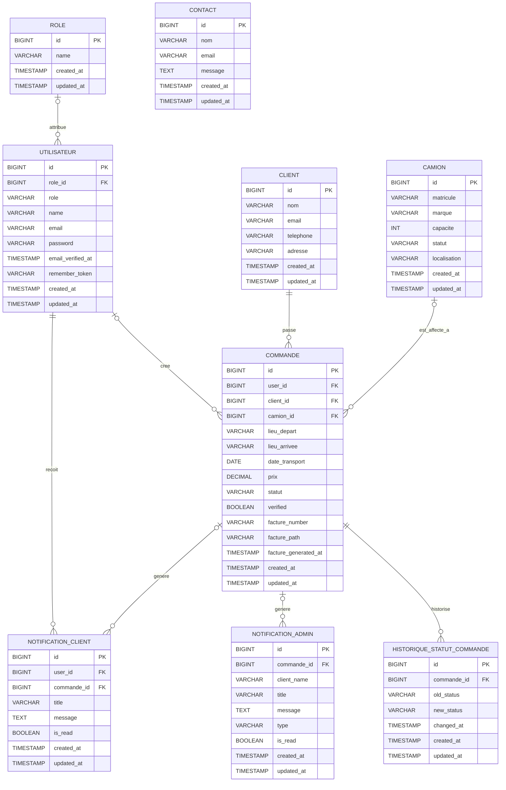

# MCD - Rapid Trans

## Périmètre retenu

Ce MCD couvre uniquement les entités métier réellement présentes dans le code Laravel. Les tables techniques du framework (`sessions`, `cache`, `password_reset_tokens`, `personal_access_tokens`, `jobs`) sont volontairement exclues du diagramme.

## Entités et attributs

- Rôle: `id`, `name`, `created_at`, `updated_at`
- Utilisateur: `id`, `role_id`, `role`, `name`, `email`, `password`, `email_verified_at`, `remember_token`, `created_at`, `updated_at`
- Client: `id`, `nom`, `email`, `telephone`, `adresse`, `created_at`, `updated_at`
- Camion: `id`, `matricule`, `marque`, `capacite`, `statut`, `localisation`, `created_at`, `updated_at`
- Commande: `id`, `user_id`, `client_id`, `camion_id`, `lieu_depart`, `lieu_arrivee`, `date_transport`, `prix`, `statut`, `verified`, `facture_number`, `facture_path`, `facture_generated_at`, `created_at`, `updated_at`
- Notification client: `id`, `user_id`, `commande_id`, `title`, `message`, `is_read`, `created_at`, `updated_at`
- Notification admin: `id`, `commande_id`, `client_name`, `title`, `message`, `type`, `is_read`, `created_at`, `updated_at`
- Historique statut commande: `id`, `commande_id`, `old_status`, `new_status`, `changed_at`, `created_at`, `updated_at`
- Contact: `id`, `nom`, `email`, `message`, `created_at`, `updated_at`

## Relations et cardinalités

- Un rôle peut être associé à 0..N utilisateurs, et un utilisateur a 0..1 rôle via `role_id`.
- Un utilisateur peut créer 0..N commandes, et une commande est liée à 0..1 utilisateur via `user_id`.
- Un client peut passer 0..N commandes, et chaque commande appartient à 1..1 client via `client_id`.
- Un camion peut être affecté à 0..N commandes, et une commande est liée à 0..1 camion via `camion_id`.
- Un utilisateur peut recevoir 0..N notifications client, et chaque notification client appartient à 1..1 utilisateur via `user_id`.
- Une commande peut générer 0..N notifications client, et une notification client est liée à 0..1 commande via `commande_id`.
- Une commande peut générer 0..N notifications admin, et une notification admin est liée à 0..1 commande via `commande_id`.
- Une commande possède 0..N lignes d’historique de statut, et chaque ligne d’historique appartient à 1..1 commande via `commande_id`.
- Le contact reste indépendant, sans relation métier vers les autres entités.

## Diagramme Mermaid

## Lecture rapide

- `commande.client_id` est obligatoire, donc la commande appartient toujours à un client.
- `commande.user_id` et `commande.camion_id` sont optionnels, ce qui permet de créer la commande avant affectation.
- `notifications` correspond au modèle `ClientNotification`, tandis que `admin_notifications` correspond au modèle `AdminNotification`.
- `role` dans `users` est un champ de compatibilité; la relation métier porte bien sur `role_id`.
