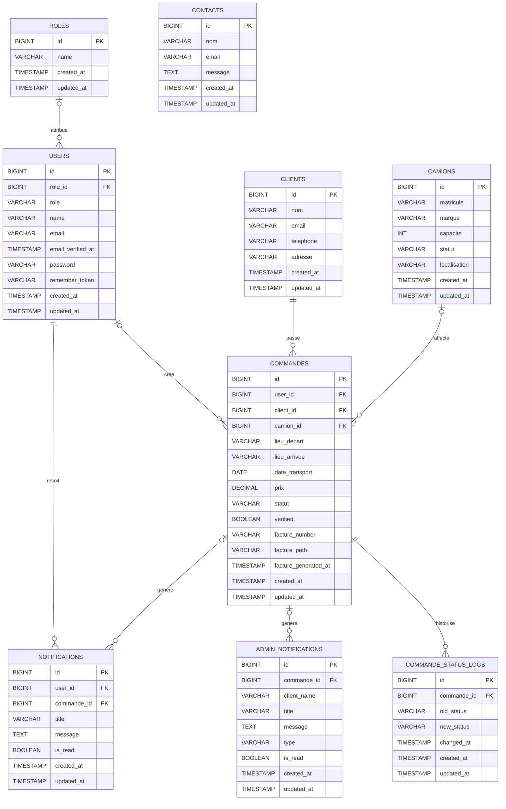

# MLD - Rapid Trans

## Périmètre retenu

Ce MLD est dérivé des migrations et modèles Laravel réellement présents dans le projet. Il reprend les tables métier existantes sans inventer de structure supplémentaire.

Tables couvertes:

- `roles`
- `users`
- `clients`
- `camions`
- `commandes`
- `notifications`
- `admin_notifications`
- `commande_status_logs`
- `contacts`

## 1) Tables relationnelles avec PK et FK

### `roles`
- PK: `id`
- Attributs: `name`, `created_at`, `updated_at`

### `users`
- PK: `id`
- FK: `role_id` -> `roles.id` (0..1)
- Attributs: `role`, `name`, `email`, `email_verified_at`, `password`, `remember_token`, `created_at`, `updated_at`

### `clients`
- PK: `id`
- Attributs: `nom`, `email`, `telephone`, `adresse`, `created_at`, `updated_at`

### `camions`
- PK: `id`
- Attributs: `matricule`, `marque`, `capacite`, `statut`, `localisation`, `created_at`, `updated_at`

### `commandes`
- PK: `id`
- FK: `user_id` -> `users.id` (0..1)
- FK: `client_id` -> `clients.id` (1..1)
- FK: `camion_id` -> `camions.id` (0..1)
- Attributs: `lieu_depart`, `lieu_arrivee`, `date_transport`, `prix`, `statut`, `verified`, `facture_number`, `facture_path`, `facture_generated_at`, `created_at`, `updated_at`

### `notifications`
- PK: `id`
- FK: `user_id` -> `users.id` (1..1)
- FK: `commande_id` -> `commandes.id` (0..1)
- Attributs: `title`, `message`, `is_read`, `created_at`, `updated_at`

### `admin_notifications`
- PK: `id`
- FK: `commande_id` -> `commandes.id` (0..1)
- Attributs: `client_name`, `title`, `message`, `type`, `is_read`, `created_at`, `updated_at`

### `commande_status_logs`
- PK: `id`
- FK: `commande_id` -> `commandes.id` (1..1)
- Attributs: `old_status`, `new_status`, `changed_at`, `created_at`, `updated_at`

### `contacts`
- PK: `id`
- Attributs: `nom`, `email`, `message`, `created_at`, `updated_at`

## 2) Relations entre tables

- `roles` 1..N `users`: un rôle peut être attribué à plusieurs utilisateurs, et un utilisateur a au plus un rôle.
- `users` 1..N `commandes`: un utilisateur peut créer plusieurs commandes, et une commande peut ne pas encore être rattachée à un utilisateur.
- `clients` 1..N `commandes`: un client passe plusieurs commandes, et chaque commande appartient à un seul client.
- `camions` 1..N `commandes`: un camion peut être affecté à plusieurs commandes au cours du temps, et une commande peut être créée sans camion.
- `users` 1..N `notifications`: un utilisateur peut recevoir plusieurs notifications client.
- `commandes` 1..N `notifications`: une commande peut générer plusieurs notifications client.
- `commandes` 1..N `admin_notifications`: une commande peut générer plusieurs notifications admin, même si la contrainte métier vise une notification de suivi par commande et type.
- `commandes` 1..N `commande_status_logs`: une commande peut avoir plusieurs changements d’état historisés.
- `contacts` reste indépendant.

## 3) Diagramme Mermaid

## Lecture rapide

- `client_id` est obligatoire dans `commandes`, donc une commande appartient toujours à un client.
- `user_id` et `camion_id` sont optionnels dans `commandes`, ce qui permet la création avant affectation.
- `notifications` est la table relationnelle utilisée pour les notifications client.
- `admin_notifications` reste une table de suivi dédiée à l’administration.
- `commande_status_logs` conserve l’historique des changements d’état de commande.